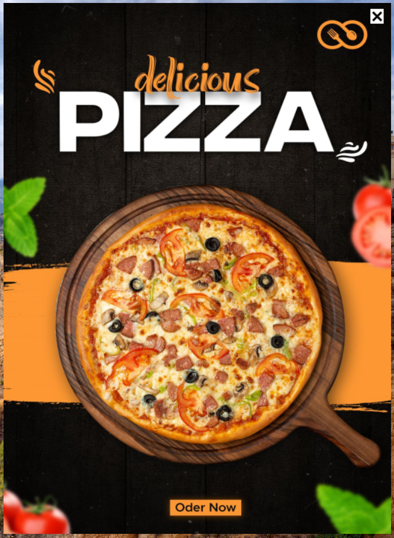
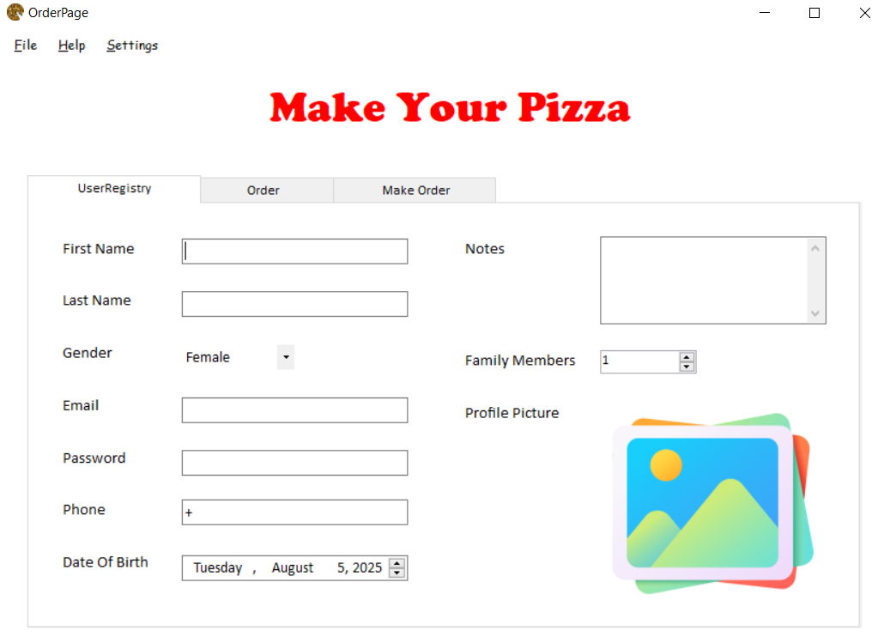

#  🍕 Pizza Order App

---

## 📋 Overview
Pizza Order App is a simple **C# desktop application** that allows users to customize and place pizza orders through a user-friendly interface. The app supports selecting pizza sizes, toppings, and drinks, then calculates the total price instantly. It's ideal for beginners learning Windows Forms and event-driven programming in C#.

---

## ✨ Features
- 🍕 Select pizza size (Small, Medium, Large)
- 🧀 Choose toppings (Cheese, Pepperoni, Vegetables, etc.)
- 🍟 Add side items (Drinks, Fries, etc.)
- 📝 Live order summary and total price calculation
- 💰 Checkout button with receipt simulation
- 🖼️ Upload and display user profile image
- 📅 Date & time picker for order scheduling
- 🧭 Tabbed interface for navigation between registration and ordering
- 🌐 Open social media and email from buttons

---

## 🔧 Technologies Used
- **Language**: C#
- **Framework**: .NET Framework (WinForms)
- **IDE**: Visual Studio
- **Platform**: Desktop (Windows)

---

## 🖼️ Image Preview
Here’s a quick preview of the app:

---

## 👤 Author
Written with passion by – @FaresSaleemGHub

---

## 📜 License
This project is open-source and available under the MIT License.
